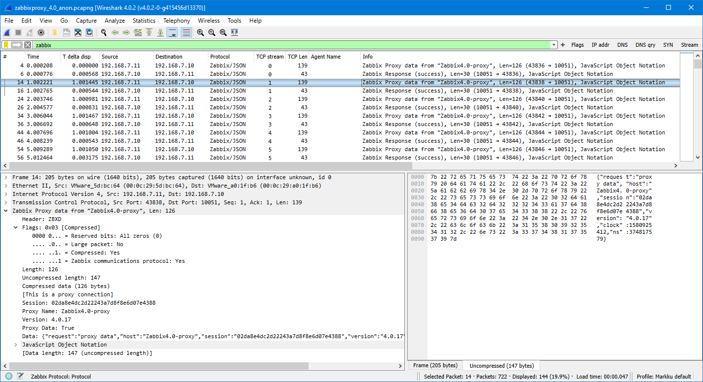

# Zabbix protocol dissectors for Wireshark

> [!IMPORTANT]
> Wireshark version 4.1.0rc0 and newer (since August 2023) already has Zabbix protocol
> dissector built in. Using the Lua scripts in this repo are thus no more needed or useful.
> These scripts will not be developed any further. For any problems or feature requests
> with the built-in dissector please go to
> [Wireshark repository in gitlab.com](https://gitlab.com/wireshark/wireshark)
> and open an issue there.

Experimental Wireshark dissectors for Zabbix protocol. Can be used for inspecting the Zabbix
server, proxy or agent communication, especially with Zabbix 4.0 and later, where the proxy
connections use compressed data.

1. Capture the packet data (using tcpdump/tshark/Wireshark/other on the Zabbix server, proxy and/or agent,
or on the firewall between the components)
1. Install Wireshark
1. Install these dissectors (see below)
1. Open the capture file(s) in Wireshark and investigate your data
1. Use display filters to your advantage (see below)

Tested with various versions, like:
- Zabbix 4.0.0, 4.0.9, 4.0.14, 4.4.4, 6.2.0, 6.4.0beta4
- Wireshark (on 64-bit Windows) 2.6.x, 3.0.2, 3.2.1, 3.6.6, 4.0.2
- (not in all combinations but to give you an idea)

Use at your own risk.

See the commit history for the changes.

## Install instructions for Wireshark on Windows

1. Go to `%APPDATA%\Wireshark` folder
1. Create `plugins` folder if it does not exist yet, and go there
1. Copy the `.lua` files there (alternatively you can also create a subfolder and
place the files there, or clone this repo under the `plugins` folder)
1. If Wireshark is already running, use **Analyze - Reload Lua Plugins** (Ctrl-Shift-L)
1. Enable TCP protocol setting **Allow subdissector to reassemble TCP streams**
to give you correct output when requests/responses do not fit in one
IP packet
1. Edit Zabbix protocol preferences as needed (in **Preferences - Protocols**, or
by right-clicking in Zabbix/ZabbixAgent packets in capture window)

## Example of plugin in use

## Usage hints

You can use the provided sample capture files to test the dissectors. For the display filters:

- Use `zabbix or zabbixagent` to show only Zabbix protocol messages (`zabbix` is the protocol that
is used with port 10051 in Zabbix, `zabbixagent` is the passive agent protocol in port 10050)
- Use `zabbix.agent` (or `zabbix.proxy`) to show only agent (proxy) messages
- Use `zabbix.agent.activechecks == 1` to show the active agents requesting for items
to check for
- Use `zabbix.agent.data == 1` to show the active agents sending data to Zabbix server/proxy
- Try `zabbix.agent.name` as a column
- `zabbix.datalen` always returns the uncompressed length, regardless of
compression or TCP reassembly in use or not

Add a column for `zabbix.time or zabbixagent.time` to display the time between
request and response. (You can even set it to
`zabbix.time or zabbixagent.time or icmp.resptime or icmpv6.resptime or http.time or dns.time`
and so on to show your other response times in the same column.)

See the Zabbix protocol tree in captured packets to see other fields that are
available for filtering, or go to **View - Internals - Supported Protocols** and
filter for Zabbix to see all the registered fields. Or just enter `zabbix.` or
`zabbixagent.` in the display filter and browse the list.

TLS decryption can be used if configured properly in Wireshark and also in
capturing (session keys are needed at least with TLS 1.3, see for example
https://security.stackexchange.com/questions/215358/extracting-openssl-pre-master-secret-from-apache2/215397#215397).
The provided TLS samples include the session keys embedded in the capture files
(https://wiki.wireshark.org/TLS#Embedding_decryption_secrets_in_a_pcapng_file).

## Limitations

- Code assumes Zabbix-generated "compact" form of JSON (no extra spaces or line feeds)
- Not all Zabbix component combinations have been tested or implemented
- Large packet support (used for multi-gigabyte proxy configurations as of 7/2022) is implemented
with separate `zabbix.large.*` fields
- Lua dissector performance is not as good as in C dissectors, but is quite adequate when using
moderately-sized capture files
- Wireshark can/will crash if a Lua dissector field is used in a custom column, and you reload the
Lua plugins or you change to a profile using those custom fields (workaround for the latter is
to select the profile before opening any capture file in Wireshark); see
http://wireshark.marwan.ma/lists/wireshark-dev/201508/msg00059.html

## Links to relevant Zabbix documentation

- https://www.zabbix.com/documentation/current/manual/appendix/items/activepassive
- https://www.zabbix.com/documentation/current/manual/appendix/protocols/header_datalen
- https://www.zabbix.com/documentation/current/manual/appendix/protocols/server_proxy
